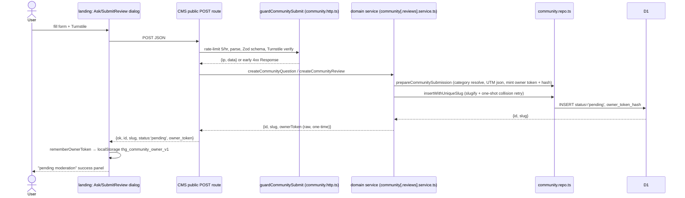
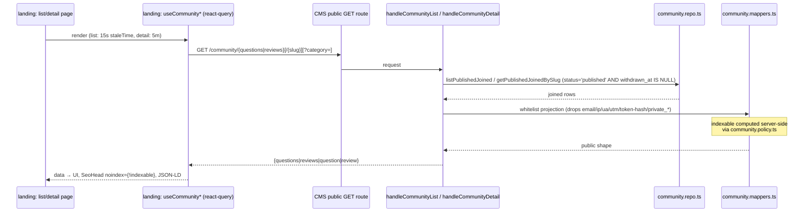
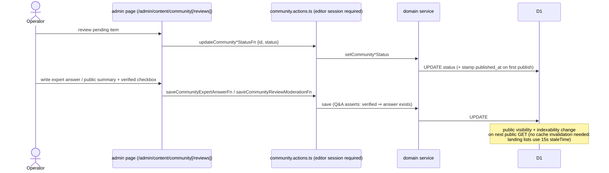
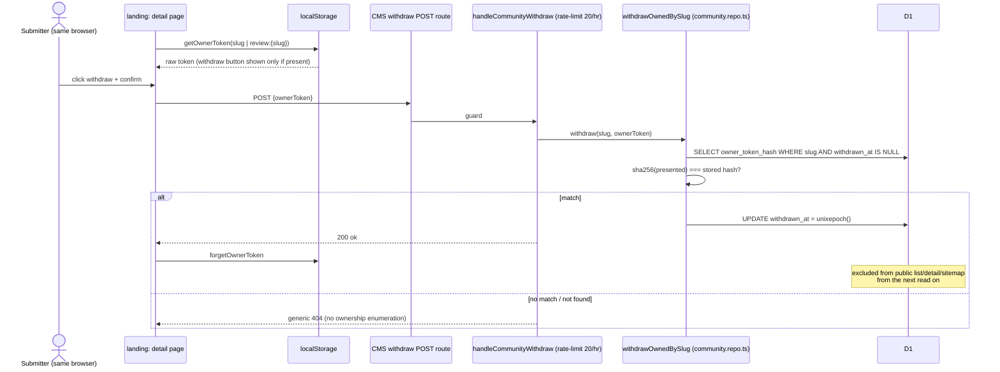
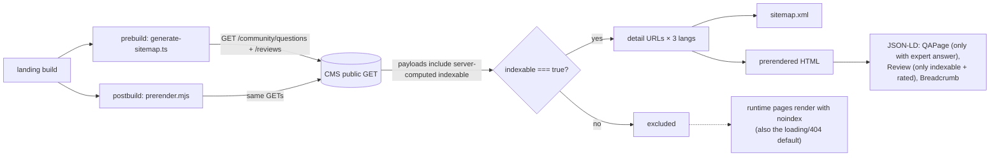
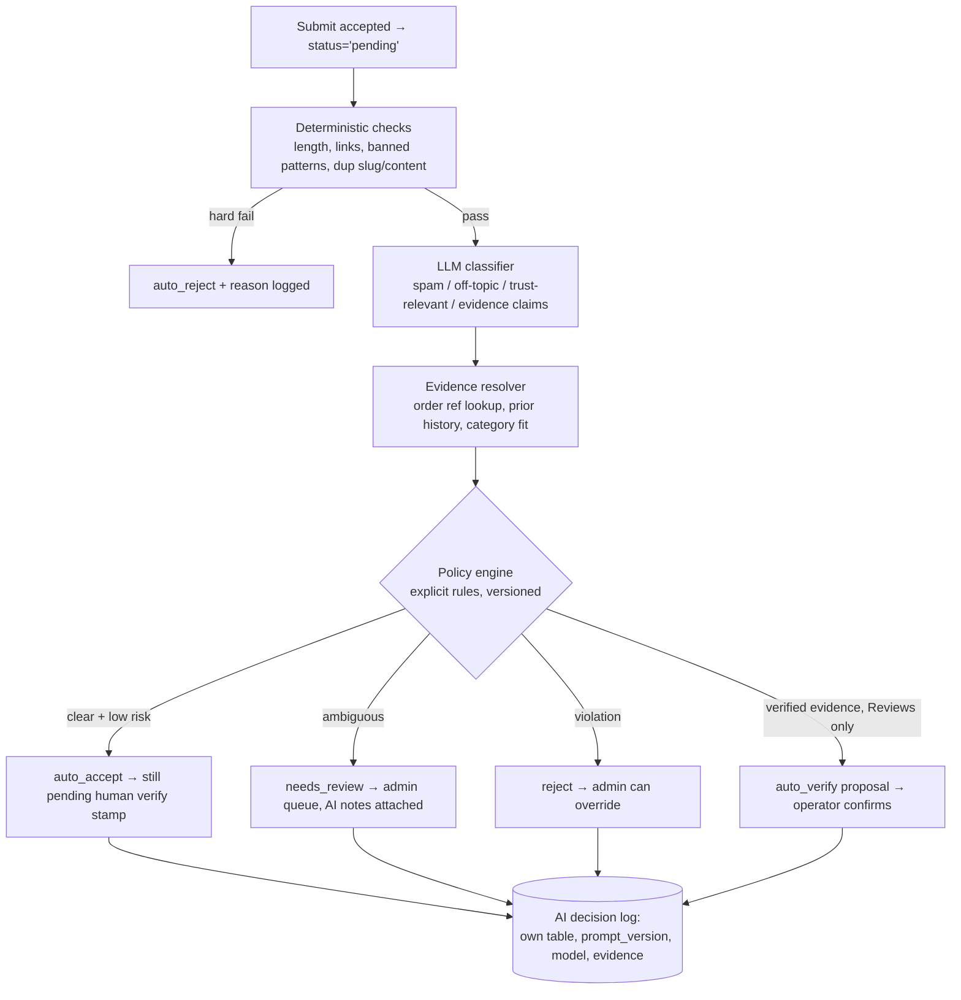

# THG Community — Flow Diagrams

Mermaid diagrams for the six core flows. File references are CMS-side unless
prefixed with `landing:`. See [ARCHITECTURE.md](./ARCHITECTURE.md) for the
role map.

## A. Public submit flow

Applies to both Q&A (`POST /api/v1/community/questions`) and Reviews
(`POST /api/v1/community/reviews`).

## B. Public read flow

## C. Admin moderation flow

## D. Withdraw flow

## E. SEO / prerender flow

## F. Future AI moderation flow (design target — not built)

The AI pipeline slots between the submit guard and the moderation state
machine. It may only *propose*; publishing stays behind the policy engine
and (for anything user-visible) human review.

Boundary rules for this pipeline (agreed before any code):

- AI writes to its **own** tables/log — never mutates public shapes directly.
- `verified` remains an operator (or operator-confirmed) stamp.
- Every AI decision is logged with prompt/model version for audit.
- The deterministic layer runs first; the LLM is never the only gate.
