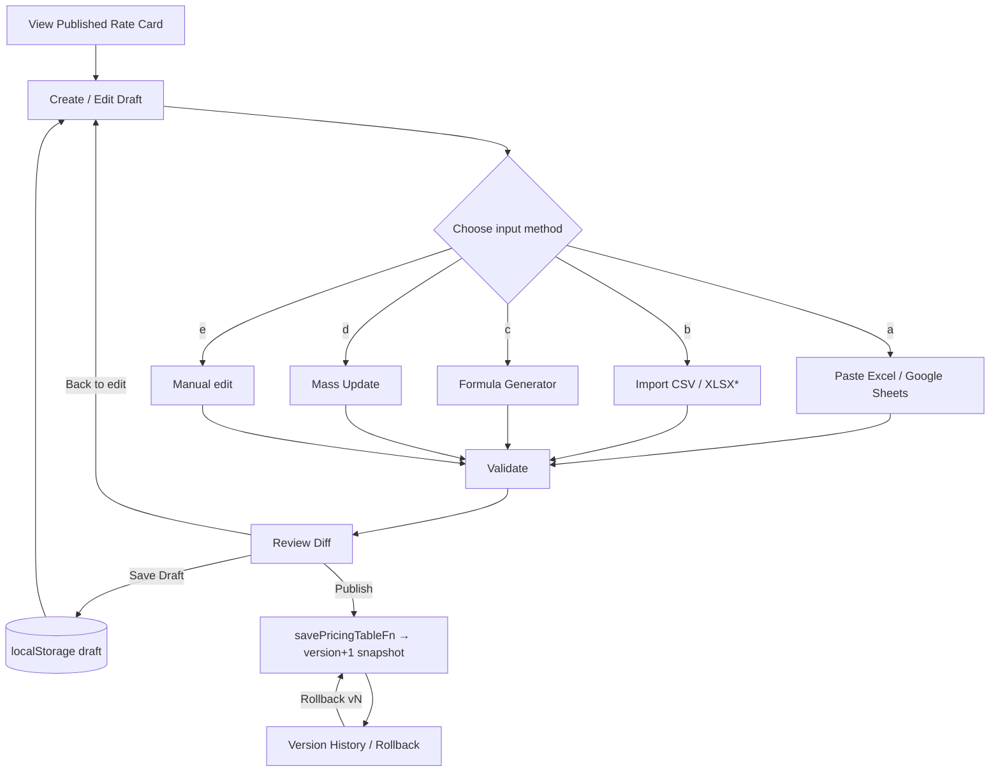
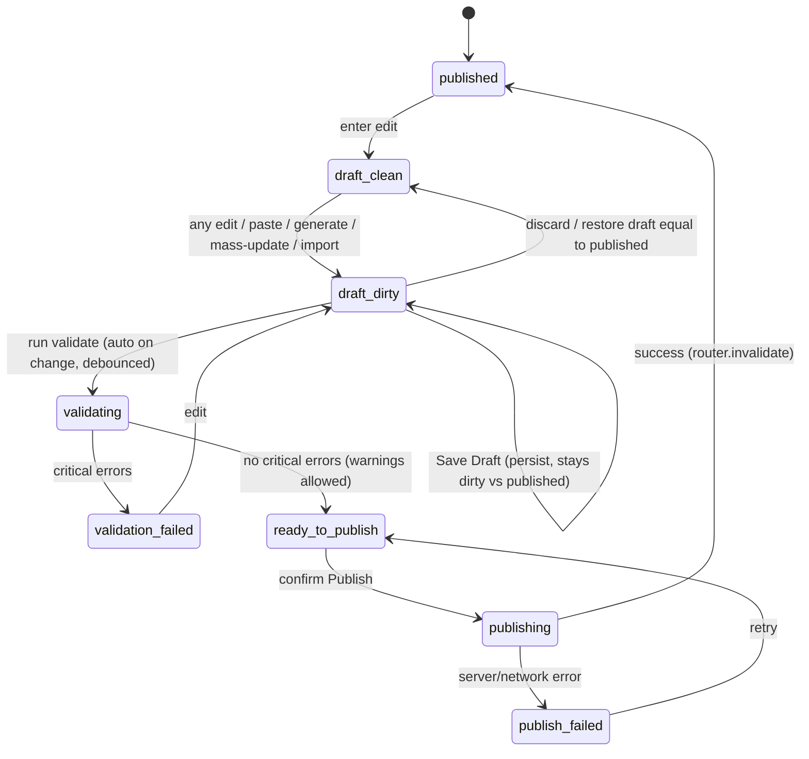
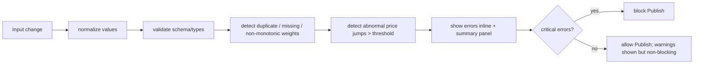

# Rate Card Builder — Design & Implementation Plan

> Module: `src/features/pricing` (CMS, TanStack Start + D1).
> Goal: turn the cell-by-cell `weight_grid` editor into a **production-grade Rate Card
> Builder** for internal ops — fast input, strong validation, clear diff review, controlled
> publish, version/rollback-ready. Pricing data is sensitive: one wrong zero can make a quote
> lose money, so the UX is optimized for *fast entry + hard validation + clear diff + controlled
> publish + rollback*.

## Why this design (constraints honored)

- **No risky migration.** Backend already stores `pricing_tables` (live row) +
  `pricing_table_versions` (immutable snapshots) and `savePricingTable()` does an atomic
  *snapshot-then-bump*. That gives versioning + rollback for free. The missing piece was the
  *editing workflow*, which is a frontend concern → we implement a **frontend draft state
  machine** + a small **additive backend rollback action**. No schema change.
- **Backward compatible.** `meta_kv` tables keep the existing `PricingSpreadsheetEditor`.
  `weight_grid` tables get the new `RateCardBuilder`. The save/publish API is unchanged
  (`savePricingTableFn`), so live data keeps rendering on the landing page.
- **Values are not strictly numeric.** The landing consumer (`ExpressVnUsPanel.tsx`) reads
  `r.kg` / `r.price` where `kg` may be a bracket string (`"21-30"`, `">30"`) and `price` may be
  `"Liên hệ"`. Validation therefore **warns** on non-numeric values rather than hard-blocking,
  so we never break existing tables.
- **No hard-coding.** Columns, weight step, currency are read from `schema_json` / inferred,
  never from UPS/HCM/US literals.
- **AI Copilot:** only an extension point (`parseHook`) is reserved — no AI infra is built.

## 1. Main user flow

## 2. State machine

Implementation: `useRateCardEditor` derives the status from `(isDirty, validation.criticalCount,
pending)` — it is a pure projection, not stored state, so it can never drift.

## 3. Data safety flow

Severity policy:
- **critical** (blocks publish): empty weight, empty price, duplicate weight, non-positive
  numeric weight, negative price, non-integer price (when numeric).
- **warning** (publish allowed, shown loudly): non-monotonic weight, missing expected step,
  abnormal price jump (>30% default, configurable), non-numeric value in a numeric column
  (e.g. `"Liên hệ"`), row-count mismatch on full replace.

## Module map (pure logic = unit-tested; UI = thin)

| File | Responsibility | Tested |
|------|----------------|--------|
| `rateCardTypes.ts` | Shared types, config inference (`inferGridConfig`) | indirectly |
| `rateCardParse.ts` | Clipboard TSV/CSV parse, VND price normalization, auto-expand | ✅ |
| `rateCardFormula.ts` | Formula generator + apply modes | ✅ |
| `rateCardMassUpdate.ts` | Scope + operation + rounding + impact preview | ✅ |
| `rateCardValidation.ts` | All validation rules + severity | ✅ |
| `rateCardDiff.ts` | Added/removed/updated/unchanged + price deltas | ✅ |
| `rateCardCsv.ts` | CSV export + import parse | ✅ |
| `useRateCardEditor.ts` | State machine, undo/redo, draft persistence | — |
| `RateCardBuilder.tsx` | Orchestrator for `weight_grid` | — |
| `RateCardGrid.tsx` | Grid: paste, keyboard, changed-cell highlight | — |
| `RateCardToolbar.tsx` | Actions | — |
| `FormulaGeneratorDialog/MassUpdateDialog/ImportRateCardDialog/RateCardDiffDialog.tsx` | Dialogs | — |

## Backend delta (additive only)

- `rollbackPricingTableFn(slug, version)` → loads snapshot, re-publishes as a *new* version
  (forward rollback, preserves full history, bumps `cms:rev`). Requires `editor`.

## Production hardening (pre-deploy pass)

- **Optimistic concurrency.** `savePricingTable` takes `expectedVersion` (the version
  the editor loaded). The guard is the **conditional UPDATE** `WHERE id=? AND version=?`
  — if it affects 0 rows (someone published since load), it throws
  `PricingVersionConflictError` (409). Atomic (no TOCTOU), independent of the snapshot
  UNIQUE constraint. UI shows a conflict banner with a "Tải lại" action; the operator
  reloads onto the new version and re-applies. Rollback intentionally omits the guard.
- **Permissions.** Both editors (`RateCardBuilder` weight_grid, `PricingSpreadsheetEditor`
  meta_kv) gate edit/publish/rollback affordances behind `canEdit` (role ≥ editor, from
  route context). The grid is read-only for viewers. Backend (`savePricingTableFn`,
  `rollbackPricingTableFn`) independently enforces `requireSession("editor")` — UI hiding
  is convenience, not the security boundary.
- **Validation strictness.** A column whose **published** values are all numeric is
  inferred "strict numeric"; non-numeric input there is a **critical** error (blocks
  publish). Columns that already hold text ("Liên hệ", brackets) stay lenient (warning).
  This prevents a silent text-into-numeric publish while not breaking existing text tables.
- **CSV hardening.** Export neutralizes formula injection (`= + - @` / tab / CR leads on
  text cells, numbers untouched). Import auto-detects `\t` / `;` / `,` (ignoring separators
  inside quoted labels) and reports per-row column-count mismatches instead of failing
  silently.
- **Publish integrity.** Publish merges `{...originalSchema, columns, currency, step}` so
  backend-stored schema metadata is never dropped; `denormalizeWeightGrid` always emits a
  valid array and coerces numeric columns. No `JSON.stringify(undefined)` poisoning.
- **Unsaved-changes guard.** `useBlocker` blocks in-app navigation while dirty; the hook's
  `beforeunload` covers tab close/reload. Both clear after publish/save.
- **CI.** `deploy.yml` gates on type-check → `bun test` → build → wrangler, plus
  post-deploy smoke tests on `/translations` and `/openapi`.

## Known limitations

- Draft persistence is **local** (localStorage, per-browser). A draft is not shared across
  users/devices. This is intentional (no migration); a server-side draft row is a future step.
- XLSX import/export is an extension point; only CSV ships now.
- Undo/redo covers table-data operations (edit/paste/generate/mass-update/import), not column
  add/remove (column-shape changes clear the undo history to avoid desync).
- **Concurrency is detect-not-merge.** On a version conflict the operator must reload and
  re-apply; their unsaved edits are not auto-merged (and the local draft, keyed by the old
  version, is discarded on reload). Acceptable for a low-write internal tool; a server-side
  draft + 3-way merge is the future step.
- **Strict-numeric is per-published-data, frozen at load.** Introducing the *first*
  "Liên hệ" into a column that is currently all-numeric is blocked as critical (by design,
  to prevent typos). To intentionally allow text there, the column type must be changed
  (no in-grid affordance yet) — a known trade-off favoring safety.
- Repo-wide `eslint .` has large **pre-existing** formatting debt (unrelated to this work),
  so CI gates on type-check + tests + build rather than full-repo lint. The pricing module
  itself is lint-clean (0 errors).
